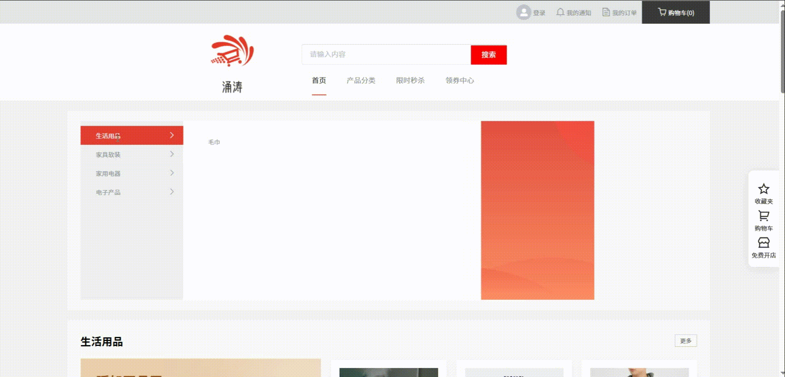
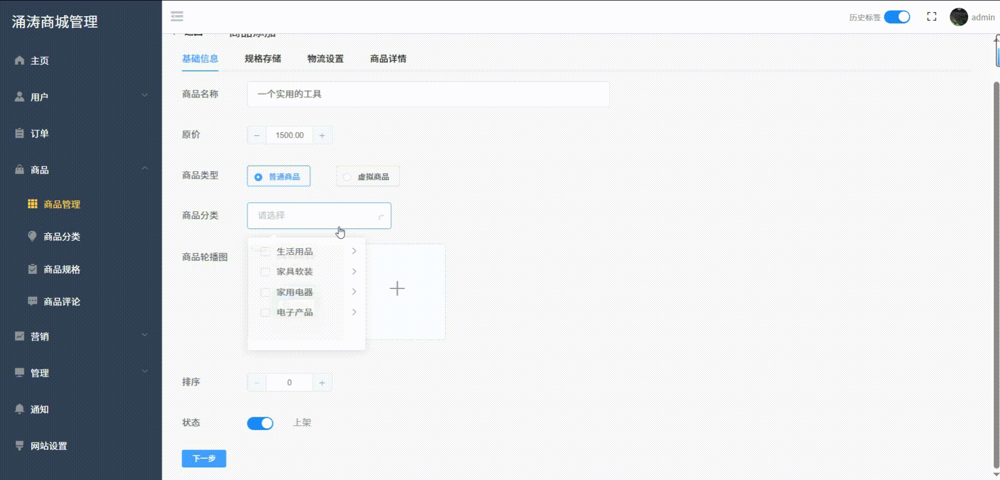

# YongTaoMall

YongTaoMall 是一个基于 Vue 2 和 ThinkPHP 6 的商城项目，包含用户端、后台管理端、后端接口服务和数据库初始化脚本。

## 项目预览






## 项目结构

```text
YongTaoMall/
├── client/      # 商城用户端 Vue 项目
├── manage/      # 后台管理端 Vue 项目
├── server/      # ThinkPHP 后端接口服务
├── yongtao.sql  # MySQL 数据库脚本
└── readme.txt   # 原始部署说明
```

## 技术栈

- 前端：Vue 2、Vue Router、Vuex、Element UI、Axios
- 后台管理端：Vue 2、Element UI、Vue Quill Editor、Axios
- 后端：ThinkPHP 6、PHP 7.2.5+
- 数据库：MySQL 8.0

## 环境要求

- Node.js
- npm
- PHP 7.2.5 或更高版本
- Composer
- MySQL 8.0

## 安装与运行

### 用户端

```bash
cd client
npm install
npm run serve
```

### 后台管理端

```bash
cd manage
npm install
npm run serve
```

### 后端服务

```bash
cd server
composer install
php think run
```

## 数据库配置

1. 创建 MySQL 数据库。
2. 导入 `yongtao.sql`。
3. 根据本地数据库信息修改 `server/.env` 和 `server/config/database.php` 中的连接配置。

## 构建

```bash
cd client
npm run build

cd ../manage
npm run build
```

## 说明

仓库默认不提交依赖目录、构建产物、运行缓存和本地环境配置。首次拉取项目后需要分别安装前端依赖和后端 Composer 依赖。
